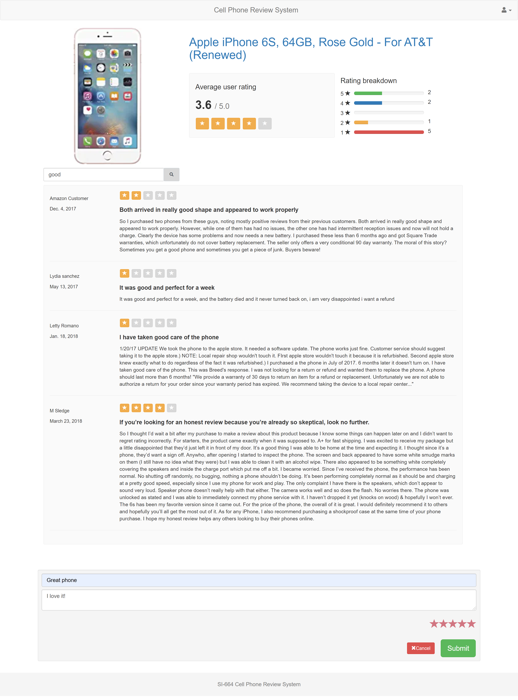

# Cell Phone Review System

[SI-664](https://dj4e.com) Course Project

## Authors

- Haotian Wang (<hautian@umich.edu>)
- Boyang Zhang (<boyzhang@umich.edu>)

## Proposal

With the advancement of technology, cell phones have become very popular, and the design of cell phones has become more diverse. When choosing a cell phone, people will consider many factors, such as price, performance and appearance, and try to compare these factors with other brands. In order to help customers decide which cell phone to buy, we decide to build a cell phone review system, which allows users to search the reviews of other customers.

The similar web site is <https://www.phonearena.com>. We use 1.4 million cell phone reviews dataset on Kaggle to build our project. The dateset can be found on <https://www.kaggle.com/masaladata/14-million-cell-phone-reviews>. In this dataset, it includes 11 fields, including `phone_url`, `date`, `language`, `country`, `source`, `domain`, `score`, `score_max`, `extract`, `author` and `product`. These different elements will form diversified cell phone reviews which can help people choose the phone that works best for them from different views.

Besides, we have more interactions in this system like: log in and log out, give "likes" to interested phones, and write down their own cell phone reviews.

## UI Design

The first image is our home page of cell phone review system. We put our website name as well as login and log out function in the navigation bar. Then we have 4 selectors - "Manufacturer", "Carrier", "Source" and "Language" below, which allows us to filter specific phone reviews. Each filter has several attributes to select. Besides, if you don’t have any specific phone reviews to search or you just want to randomly scan on one phone review, you can also click on the phone images below to enter the detail page.

For the second image, it is our log in page. In this page, you need to type in your email address and password to sign in. We also add a "Remember me" button to your convenience. 

For the third image, it is still our home page after logging in. The difference between two web pages is that when user logs in to his/her account, the location where "Log in" is displayed will show a user icon, and when you click on the icon, a drop-down menu will appear, showing "Log out" option.

For the fourth image, it is our detail page when you click on the phone image in home page. In this page, it shows detailed phone reviews including phone images, phone brands, rank scores, authors, updating time, and detailed reviews. Below the reviews table, you can write down your own review as well as score the cell phone. In the end, you can submit your review by clicking the "Submit" button below the text area or cancel your review by clicking the "Cancel" button.




## Data Models


## Installation

1. Install dependencies.

    ```bash
    cd cprs
    pip install -r requirements.txt
    ```

2. Migrate database.

    ```bash
    python manage.py migrate
    ```

3. Add GitHub social login key
    - Go to <https://github.com/settings/developers>
    - Add a `New OAuth2 App`
    - If you are running on localhost, here are some settings:
        > Application name: Cell Phone Review System  
        > Homepage URL: <http://localhost/>  
        > Authorization callback URL: <http://localhost/oauth/complete/github/>

      If you are running on your server, here are some settings:
        > Application name: Cell Phone Review System  
        > Homepage URL: <http://your-server-domain/>  
        > Authorization callback URL: <http://your-server-domain/oauth/complete/github/>

      Please note the difference between **http** and **https**. If your server is connected using `https` protocol, please replace all `http` in the address with `https`. Using the wrong protocol will result in failure to log in.
4. Copy `Client ID` and `Client Secret` to `cprs/cprs/github_settings.py`.
5. Start server in debug mode.

    ```bash
    python manage.py runserver 0.0.0.0:8000
    ```
